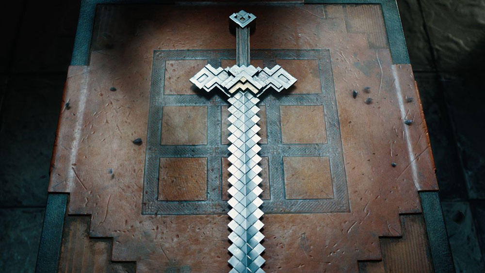

# Mobile App for Mapping Skateparks with Trick Video Detection

Repository for my thesis at WUT. This app is designed for skateboarders to easily detect trick names and find skate spots.  

If you're curious, check out this [video in Polish](https://drive.google.com/file/d/1CggOAXU7QRtOSCEz3_li4qyl0dlOoiRS/view) about the project.

---

## Description (English)

The main goal of my thesis is to develop a mobile app for skateboarders where they can film their tricks to automatically identify their names. The app will include a grading system to help users improve and track their progress.  

Additionally, the app will feature a map where skaters can add skate spot locations with photos and descriptions. This platform aims to grow the skateboarding community in Warsaw, making it easier for skaters to track their progress and find places to skate.

---

## Opis pracy (Polski)

Głównym celem pracy inżynierskiej jest stworzenie platformy mobilnej dla społeczności deskorolkowej, która analizowałaby nagrania trików deskorolkowych, automatycznie nazywała je, oceniała poprawność wykonania oraz zapisywała nagrania użytkownika.  

Dodatkowo w aplikacji znajdować się będzie mapa skateparków, którą użytkownicy będą mogli rozszerzać o zdjęcia oraz informacje o przeszkodach, stanie skateparku i innych czynnikach. Aplikacja ma na celu wspieranie rozwoju społeczności, umożliwiając jej członkom śledzenie postępów oraz lokalizowanie skateparków.

---

## Project Title

**Rozpoznawanie trików deskorolkowych w aplikacji mobilnej z funkcją mapowania skateparków**

---

## Demo Video

_Click the image to watch the video_
